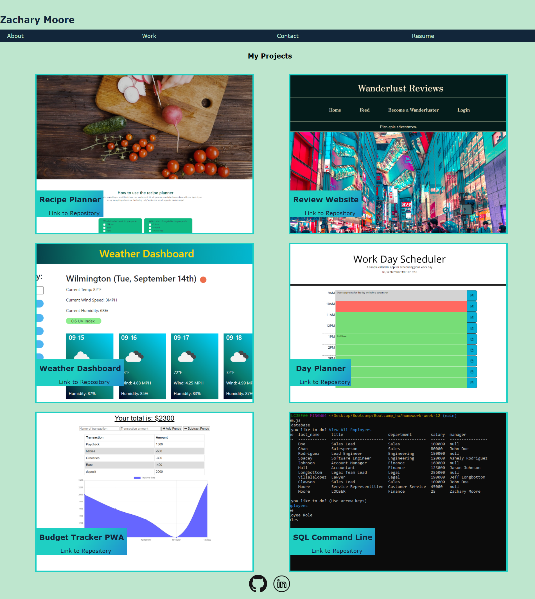

  <h1 align="center">React Portfolio</h1>
  
   
   
  ## Description
   To demonstrate knowledge of react by manipulating the virtual DOM to only render necessary changes.
   
   ## Table of Contents
   - [Description](#description)
   - [Installation](#installation)
   - [Usage](#usage)
   - [License](#license)
   - [Contributing](#contributing)
   - [Tests](#tests)
   - [Questions](#questions)
   
   ## Installation
   View the page [here](https://zmoore371.github.io/React-Portfolio) or clone repository, run npm i, then npm start
   
   ## Usage
   
   Screenshot of application
   
   
   ## License
   
    
   This application is covered by  the MIT license. 
   
   ## Contributors
   Zachary Moore
   
   ## Tests
   No tests were designed for this application.
 
   ## Questions
   Questions or concerns? Feel free to reach out to me: 
    
   Link to Github: [zmoore371](https://github.com/zmoore371) 
    
   Email me with any questions: zmoore371  